# Latihan Praktikum ke 6
 mengubah kode fungsi menggunakan lambda 
 cara memperluas daftar fungsi bisa menggunakan imort math
 
 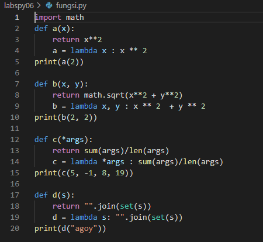

### Output

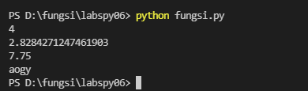

# Praktikum Ke 6
### Flowchart
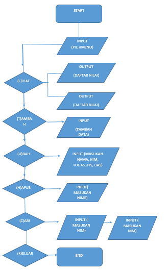

Buatlah dictionary yang akan diinput dengan data,membuat perulangan dan keterangan untuk pilihan menu.

Menambahkan data yang akan diinput kemudian masuk ke dalam dictiona.

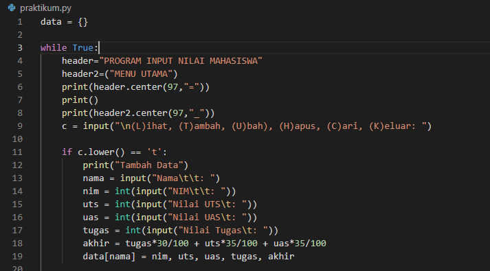

### Output
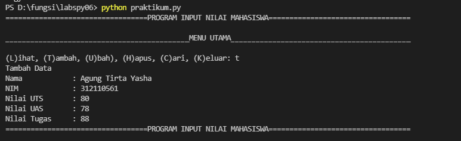

#### Penampilan Data

cara menampilkan data 

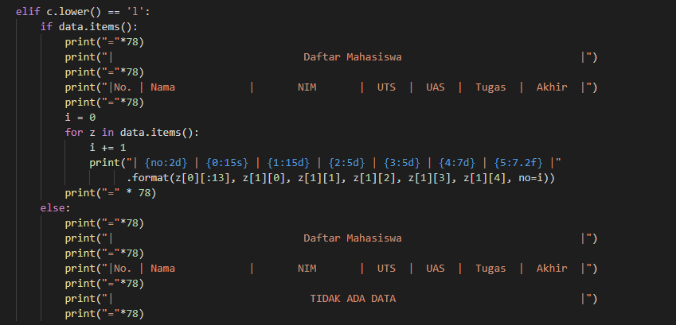

### Output 

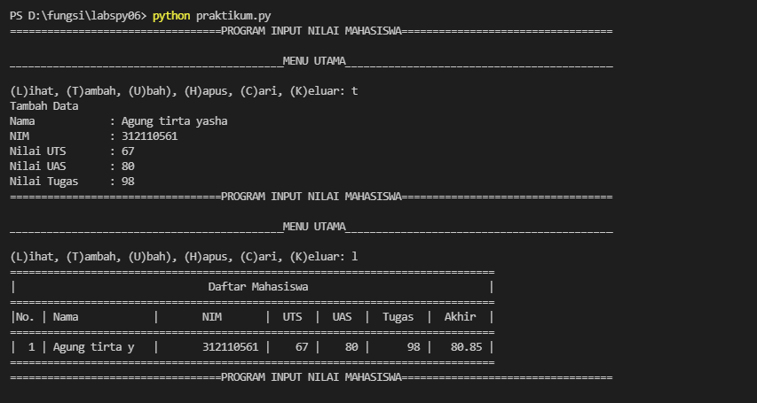

#### Ubah Data

coding pengubah data 

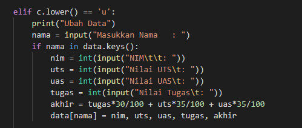

### OutPut

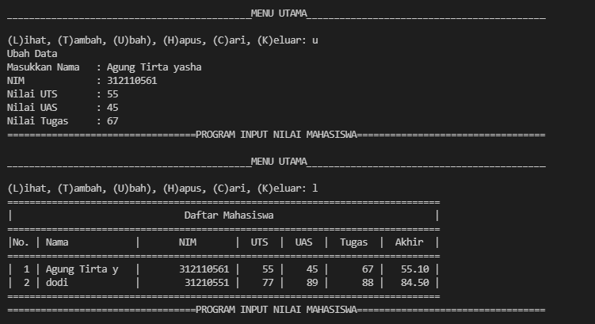

#### Mencari Data

bisa menggunakan syntax ini untuk mencari data 

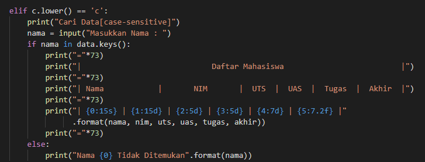

### Output
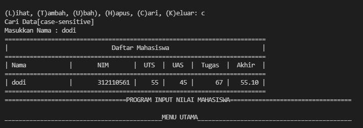

#### Menghapus data 

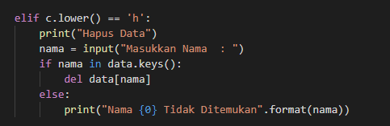

untuk menyelesaikan nya bisa pilih menu K otomatis program akan terhenti 

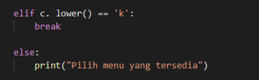

### OutPut
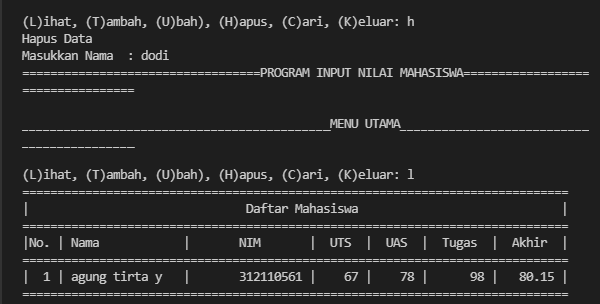

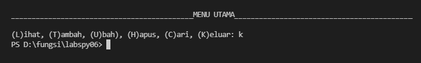

## Terima Kasih 